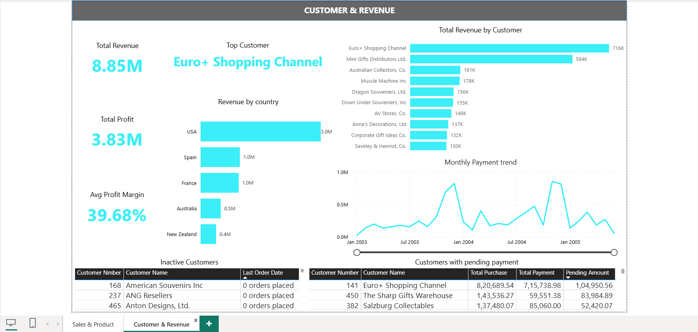
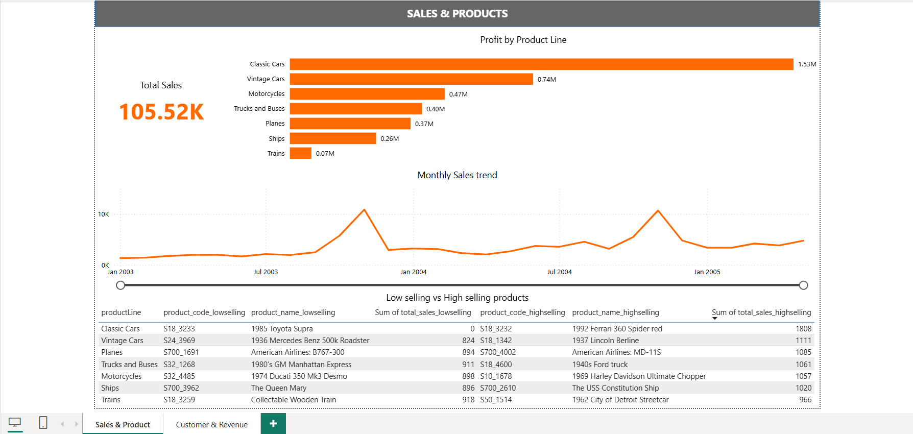

# 📊 Classic Models Business Performance Dashboard  

## 🔹 Project Overview  
This project analyzes the **ClassicModels** sample database using **SQL** for data extraction and **Power BI** for visualization.  
The goal is to uncover **key business insights** across sales, customers, products, and financial performance.  

It simulates a real-world scenario where a retail/distribution company wants to monitor performance, spot risks, and identify growth opportunities.  

---

## ⚙️ Tools & Technologies  
- **SQL (MySQL)** → Data cleaning, transformation, and business queries  
- **Power BI** → Interactive dashboards and data visualization  
- **GitHub** → Project versioning and portfolio showcase  

---

## 📌 Key KPIs  
- **Total Revenue:** $8.85M  
- **Total Profit:** $3.83M  
- **Average Profit Margin:** ~39.7%  
- **Total Sales Units:** 105.5K  
- **Top Customer:** Euro+ Shopping Channel  
- **Top Product Line:** Classic Cars  

---

## 📊 Dashboard Preview  
The Power BI dashboard is split into two main views:  

1. **Customer & Revenue Dashboard**  
   - Total revenue, profit, and margins  
   - Top customers and revenue by country  
   - Monthly payment trend  
   - Inactive customers and pending payments
   

2. **Sales & Products Dashboard**  
   - Total sales volume and profit by product line  
   - Monthly sales trend  
   - High-selling vs low-selling products  
   
